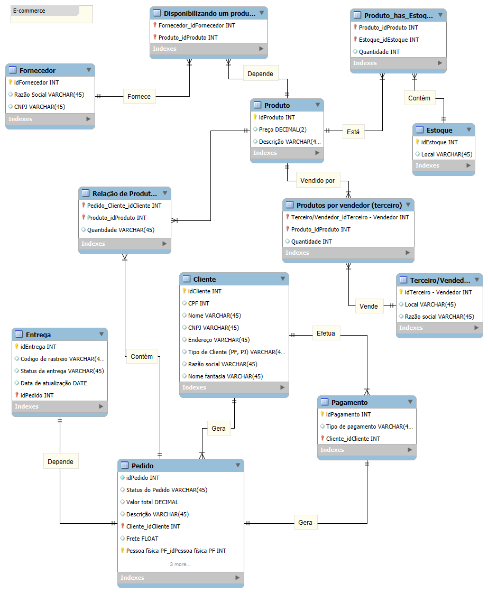

# Desafio DIO - Modelo de Banco de Dados (MySQL)

Este repositório contém a resolução do desafio proposto no **Bootcamp Randstad - Análise de Dados da DIO**

## 📊 Diagrama Entidade-Relacionamento (DER)

O modelo foi construído para representar um sistema de e-commerce, contemplando clientes, pedidos, produtos, pagamentos e entregas.

## 🚀 Tecnologias Utilizadas
- MySQL Workbench
- MySQL

## 📚 Aprendizado
Este desafio ajudou a reforçar:
- Modelagem conceitual e lógica de bancos de dados relacionais.
- Definição de relacionamentos entre entidades.
- Boas práticas na organização de tabelas.